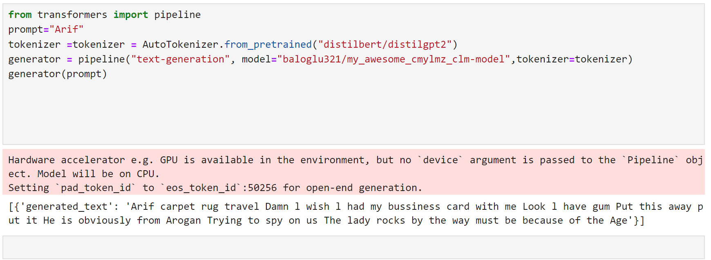

# 🧪 LLM Experiments & Learning Repository

A collection of hands-on experiments, explorations, and implementations covering fundamental concepts and advanced techniques in Large Language Models, Natural Language Processing, and AI Agents. This repository documents my learning journey through various LLM frameworks and methodologies.

## 📸 First Training Results



*Screenshot showing the first successful model training run - BERT fine-tuning on Yelp review dataset achieving 57.2% accuracy after 3 epochs*

## 🎯 Repository Overview

This is an experimental workspace containing Jupyter notebooks and code implementations exploring:

- **Foundation Concepts**: Attention mechanisms, causal language modeling
- **Model Training**: Fine-tuning with transformers, LoRA adaptations
- **Agent Frameworks**: LangGraph, LlamaIndex, Smolagents
- **Multimodal AI**: Vision agents, image understanding
- **Local LLM Integration**: Ollama server setup and optimization
- **Tool Development**: Custom tools for AI agents

## 📂 Repository Structure

```
LLM-s/
├── 📓 Core Notebooks (Root)
│   ├── LLM's_first_train.ipynb          # First BERT training experiment
│   ├── LLM's_chp1.ipynb                 # LLM fundamentals chapter 1
│   ├── Attention_Mechanisms_chp_2.ipynb # Attention mechanisms deep dive
│   ├── Causal_language_modeling.ipynb   # English version
│   ├── Causal_language_modeling-TR.ipynb # Turkish version
│   ├── ollama_server_cloudflare.ipynb   # Ollama + Cloudflare setup
│   └── tools.ipynb                      # Tool development experiments
│
├── 🤖 agents/                           # AI Agent experiments
│   ├── HG_AI_agents_1.ipynb            # HuggingFace agents basics
│   ├── Multiple_Agents.ipynb            # Multi-agent systems
│   ├── Multiple_tools.ipynb             # Multi-tool orchestration
│   ├── Ollama_with_xterm.ipynb         # Terminal-based Ollama
│   ├── Tools_local.ipynb               # Local tool development
│   ├── Vision_Agents_with_smolagents.ipynb # Vision capabilities
│   └── saved_map.png                   # Agent execution visualization
│
├── 🎓 fine_tune/                        # Model fine-tuning
│   └── Fine_tune_with_lora.ipynb       # LoRA parameter-efficient tuning
│
├── 📝 nlp_workspace/                    # NLP experiments
│   └── Nlp-LLM_works_1.ipynb          # NLP fundamentals
│
├── 📚 notebooks/unit2/                  # Structured course work
│   ├── Langraph/                       # LangGraph implementations
│   ├── LlamaIndex/                     # LlamaIndex experiments
│   └── smolagents/                     # Smolagents tutorials
│
└── 📄 Dataset Files
    ├── AROG-TR.txt, AROG-ENG-SUBTITLE.txt  # Turkish comedy scripts
    ├── GORA-TR.txt, Gora-ENG.txt          # Sci-fi comedy scripts
    ├── yahsi_bati_eng_sub-utf.txt         # Western comedy subtitles
    └── Live.csv                           # Live data experiments
```

## 🛠️ Technologies & Frameworks

### Core ML/DL Frameworks
- **PyTorch**: Deep learning framework for model training
- **Transformers (Hugging Face)**: Pre-trained models and fine-tuning
- **Datasets (HF)**: Dataset loading and processing
- **Evaluate (HF)**: Model evaluation metrics

### LLM & Agent Frameworks
- **LangChain**: Building applications with LLMs
- **LangGraph**: Building stateful multi-actor applications
- **LlamaIndex**: Data framework for LLM applications
- **Smolagents**: Hugging Face's simple agent framework

### Local LLM Infrastructure
- **Ollama**: Local LLM inference server
- **Cloudflare Tunnel**: Secure remote access to local services
- **LiteLLM**: Universal LLM API wrapper

### Training & Optimization
- **LoRA (Low-Rank Adaptation)**: Parameter-efficient fine-tuning
- **Weights & Biases (wandb)**: Experiment tracking and visualization
- **PEFT**: Parameter-Efficient Fine-Tuning library

### Supporting Tools
- **Jupyter Notebook/Lab**: Interactive development environment
- **tqdm**: Progress bars for training loops
- **numpy, pandas**: Data manipulation
- **Pillow**: Image processing (for vision agents)

## 📖 Detailed Contents

### 🎓 Foundation Concepts

#### Attention Mechanisms (`Attention_Mechanisms_chp_2.ipynb`)
- Deep dive into self-attention
- Multi-head attention implementations
- Positional encodings
- Attention visualization

#### Causal Language Modeling (`Causal_language_modeling.ipynb`)
- Autoregressive language generation
- GPT-style training
- Next-token prediction
- Available in English and Turkish versions

#### First Training Experience (`LLM's_first_train.ipynb`)
- BERT fine-tuning on Yelp reviews (5-class sentiment)
- Training with Hugging Face Trainer API
- Native PyTorch training loop implementation
- Weights & Biases integration
- **Results**: 60.8% accuracy (3 epochs), Dataset: 1,000 training samples

### 🤖 AI Agent Development

#### Smolagents Vision Agents (`agents/Vision_Agents_with_smolagents.ipynb`)
- Multimodal agent capabilities
- Image understanding with LLMs
- Tool integration for vision tasks

#### Multi-Agent Systems (`agents/Multiple_Agents.ipynb`)
- Agent-to-agent communication
- Collaborative task solving
- Agent orchestration patterns

#### Tool Development (`agents/Multiple_tools.ipynb`, `Tools_local.ipynb`)
- Custom tool creation
- Tool calling mechanisms
- Local vs cloud tool integration

### 🔧 Infrastructure & Setup

#### Ollama Server with Cloudflare (`ollama_server_cloudflare.ipynb`)
- Local Ollama installation and configuration
- Cloudflare Tunnel setup for remote access
- Model management (pulling, running)
- API integration examples
- Performance optimization

### 🎯 Advanced Techniques

#### LoRA Fine-Tuning (`fine_tune/Fine_tune_with_lora.ipynb`)
- Parameter-efficient training
- Low-rank matrix decomposition
- Memory-efficient fine-tuning
- Adapter-based transfer learning

### 📚 Structured Coursework (`notebooks/unit2/`)

#### LangGraph
- **Building Blocks of LangGraph**: Core concepts and components
- Stateful graph-based agent workflows
- Conditional branching in agent logic

#### LlamaIndex
- **LLMs Integration**: Connecting various LLM providers
- **Components**: Indexes, retrievers, query engines
- **Agents**: ReAct agents with LlamaIndex
- **Workflows**: Complex multi-step processes

#### Smolagents
- **Code Agents**: Agents that write and execute code
- **Multiagent Systems**: Collaborative agent networks
- **Retrieval Agents**: RAG-based agents
- **Tool Calling**: Advanced tool integration
- **Tools**: Custom tool development

## 🎯 Key Learning Outcomes

### Model Training & Fine-Tuning
- ✅ Successfully fine-tuned BERT for sentiment classification
- ✅ Implemented both Trainer API and native PyTorch training loops
- ✅ Integrated Weights & Biases for experiment tracking
- ✅ Explored LoRA for parameter-efficient fine-tuning

### Agent Development
- ✅ Built multi-agent systems with coordinated workflows
- ✅ Created custom tools for specialized tasks
- ✅ Implemented vision-capable agents
- ✅ Explored three major frameworks: LangGraph, LlamaIndex, Smolagents

### Infrastructure
- ✅ Set up local Ollama server for privacy-preserving LLM inference
- ✅ Configured Cloudflare tunneling for remote access
- ✅ Integrated multiple LLM providers through LiteLLM

### Advanced Concepts
- ✅ Deep understanding of attention mechanisms
- ✅ Mastered causal language modeling principles
- ✅ Applied low-rank adaptation techniques

## 🚀 Getting Started

### Prerequisites

```bash
# Python 3.8+
python --version

# Install core dependencies
pip install torch transformers datasets evaluate
pip install langchain llamaindex smolagents
pip install jupyter notebook
pip install wandb tqdm numpy pandas
```

### Running the Notebooks

1. **Clone the repository**:
   ```bash
   git clone https://github.com/baloglu321/LLM-s.git
   cd LLM-s
   ```

2. **Install dependencies** (create `requirements.txt` as needed)

3. **Launch Jupyter**:
   ```bash
   jupyter notebook
   ```

4. **Start with**:
   - `LLM's_chp1.ipynb` for fundamentals
   - `LLM's_first_train.ipynb` for hands-on training
   - Explore `agents/` for agent development

### Setting up Ollama (Optional)

Follow instructions in `ollama_server_cloudflare.ipynb` for:
- Local Ollama installation
- Model downloads
- Cloudflare Tunnel configuration

## 📊 Experiments & Results

### BERT Fine-Tuning (Yelp Reviews)

| Epoch | Training Loss | Validation Loss | Accuracy |
|-------|--------------|-----------------|----------|
| 1 | No log | 1.213 | 46.0% |
| 2 | No log | 1.014 | 55.7% |
| 3 | No log | 0.976 | **60.8%** |

**Model**: `google-bert/bert-base-cased`  
**Dataset**: Yelp Review Full (5-star ratings)  
**Training Samples**: 1,000  
**Evaluation Samples**: 1,000  
**Training Time**: ~40 minutes (3 epochs)  
**Hardware**: CUDA-enabled GPU

## 🌟 Notable Implementations

### Custom Tools
- Web search integration
- File processing utilities
- Image analysis capabilities
- Calculator and math operations

### Agent Architectures
- ReAct (Reasoning + Acting) agents
- Multi-agent collaboration systems
- Vision-augmented agents
- Code-generating agents

### Fine-Tuning Approaches
- Full model fine-tuning
- LoRA adaptation
- Parameter-efficient methods

## 📝 Future Experiments

- [ ] Implement RAG (Retrieval-Augmented Generation)
- [ ] Explore reinforcement learning from human feedback (RLHF)
- [ ] Build production-ready agent systems
- [ ] Experiment with larger models (7B+)
- [ ] Create custom multimodal models
- [ ] Implement advanced prompting techniques

## 🤝 Contributing

This is a personal learning repository, but suggestions and tips are welcome! Feel free to open issues or reach out with:
- Best practices for LLM experimentation
- Recommended resources
- Bug reports in notebooks
- Optimization suggestions

## 📚 Resources & References

### Documentation
- [Hugging Face Transformers Docs](https://huggingface.co/docs/transformers)
- [LangChain Documentation](https://python.langchain.com/)
- [LlamaIndex Documentation](https://docs.llamaindex.ai/)
- [Smolag ents Guide](https://huggingface.co/docs/smolagents)

### Courses & Tutorials
- Hugging Face NLP Course
- DeepLearning.AI courses
- LangChain Academy
- LlamaIndex tutorials

### Papers
- "Attention is All You Need" (Vaswani et al.)
- "LoRA: Low-Rank Adaptation of Large Language Models"
- "ReAct: Synergizing Reasoning and Acting in Language Models"

## 📄 License

This repository is for educational and experimental purposes. Feel free to use the code for learning.

## 🙏 Acknowledgments

- **Hugging Face**: For transformers, datasets, and agent frameworks
- **LangChain Team**: For the comprehensive agent framework
- **LlamaIndex Team**: For data-centric LLM tools
- **Ollama**: For easy local LLM deployment
- **Weights & Biases**: For experiment tracking

---

**Note**: This is an active learning repository. Notebooks may contain experimental code, incomplete implementations, and ongoing research. Use as reference for learning rather than production deployment.

**Last Updated**: January 2026  
**Status**: 🟢 Active Learning & Experimentation
